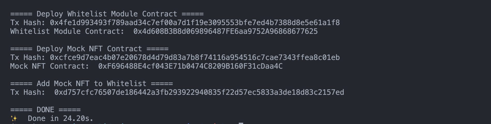
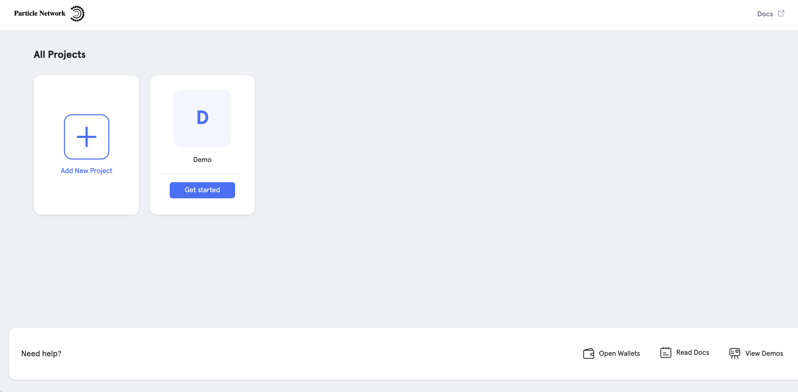
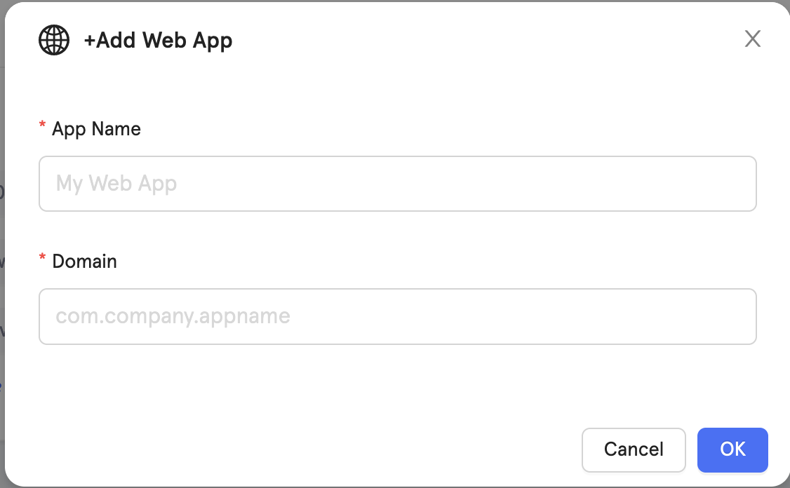
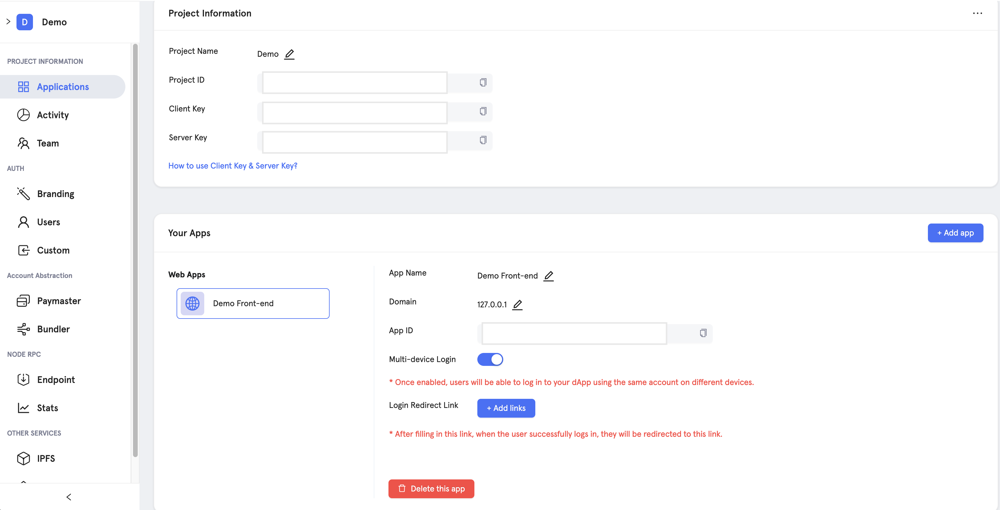
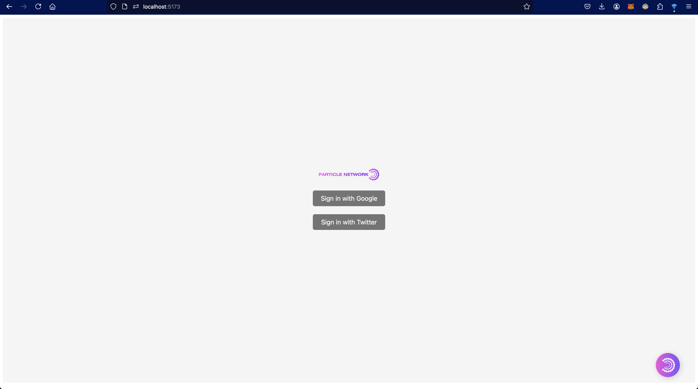

### Account Abstraction Demo

For this demo, we will guide you on how to:

- Create an Account Abstraction (ERC-4337) using Particle Network.
- Set up the `gasless transaction` feature using `Paymaster` with `Particle Network` and `Biconomy`.
- Build a simple webpage front-end to send a transaction that interacts with a smart contract.

For other use cases, please refer to the documentation provided by [Particle Network](https://developers.particle.network/reference/introduction-to-smart-waas) and [Biconomy](https://docs.biconomy.io/)

The instructions are divided into two parts:

- Smart contracts (on-chain)
- Web front-end (off-chain)

##### Smart Contract Setup

1. Clone `demo-account-abstraction` to your local workplace:

```bash
git clone https://github.com/KIP-Protocol-Contracts/demo-account-abstraction.git
cd demo-account-abstraction/session-validation-contracts
```

2. Install `Nodejs`: `v20.14.0` or `v20.15.0`:

```bash
# installs nvm (Node Version Manager)
curl -o- https://raw.githubusercontent.com/nvm-sh/nvm/v0.39.7/install.sh | bash

# download and install Node.js (you may need to restart the terminal)
nvm install v20.15.0

# verifies the right Node.js version is in the environment
node -v # should print `v20.15.0`
```

3. Install `yarn`:

```bash
npm install --global yarn

// check `yarn` already installed by running
yarn --version
```

4. Install dependencies:

```bash
yarn
```

5. Create the environment file (`.env`):

- Create `.env` file:

  ```bash
    touch .env && open .env
  ```

- Copy the following template into the `.env` file and provide your own settings:

  ```bash
  # API Key on Base Scan Explorer
  BASE_API_KEY=YOUR_API_KEY

  # Base Testnet Provider
  BASE_TESTNET_RPC=YOUR_RPC_URL

  # Deployer (Testnet) Private Key
  TESTNET_DEPLOYER=YOUR_PRIVATE_KEY
  ```

6. Compile the provided smart contracts in this directory:

```bash
yarn compile
```

7. Deploy the smart contracts onto `Sepolia Base Testnet`:

```bash
// Ensure your account has some `Base Sepolia ETH` tokens before running the following command
yarn base_test scripts/deploy.ts
```

Congratulations! You have completed the first part of this instruction. Ensure you keep `Whitelist Module Contract` and `Mock NFT Contract` addresses for the second part.

<p align="center">
  
</p>

##### Web Front-end Setup

1. Change your current directory into `front-end` directory:

```bash
// If your current directory is `session-validation-contracts`, type the following command
cd ../front-end
```

2. Install dependencies:

```bash
yarn
```

3. Register your project and your app via [Particle Network Dashboard](https://dashboard.particle.network/)

- Register your project
  <p align="center">
    
  </p>

- Choose `Web` option to register the app

  - `App Name`: Please choose the name for your app.
  - `Domain`: you can use `127.0.0.1` for a local experiment.

<p align="center">
  
</p>

4. Once registered, you will receive `projectId`, `clientKey`, and `appId`, which you will use in the next configuration step.

<p align="center">
  
</p>

5. Create the environment file

- Create `.env` file:

  ```bash
    touch .env && open .env
  ```

- Copy the following template into the `.env` file and provide your own settings:

  ```bash
    VITE_PROJECT_ID=YOUR_PARTICLE_PROJECT_ID
    VITE_CLIENT_KEY=YOUR_PARTICLE_CLIENT_KEY
    VITE_APP_ID=YOUR_PARTICLE_APP_ID
    VITE_SESSION_VALIDATION_CONTRACT_ADDR=YOUR_DEPLOYED_WHITELIST_MODULE_CONTRACT_ADDR
    VITE_DESTINATION_CONTRACT_ADDR=YOUR_DEPLOYED_MOCK_NFT_CONTRACT_ADDR
  ```

6. Build the local web front-end:

```bash
yarn dev
```

7. Enter `localhost:5173` in your web browser to run the experiment:

<p align="center">
  
</p>

Congratulations! You have completed the demo of creating `Account Abstraction` using the `Particle Network` and setting up the `gas sponsorship` feature for users interacting with your app (smart contract). Please note that `Biconomy` will sponsor the gas fee on `testnet`, but the fee must be paid by you on `mainnet`.
